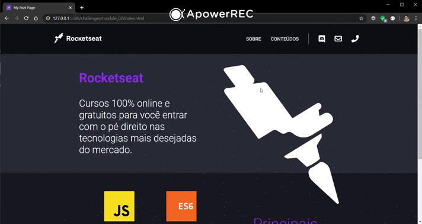

<h1 align="center">
    
</h1>

<h3 align="center">
  Desafios Módulo 2 - Iniciando no front-end
</h3>

## 📎 Módulo 1

 Neste módulo foi abordado a construção do front-end de uma página, incluindo:  
- HTML; 
- CSS; 
- Manipulação do HTML com JS; 

## 🚀 Desafios do módulo 2 resolvidos:

- [**Desafio 2-1: Primeiro HTML**](https://github.com/Rocketseat/bootcamp-launchbase-desafios-02/blob/master/desafios/02-1-primeiro-html.md)

- [**Desafio 2-2: Página de descrição**](https://github.com/Rocketseat/bootcamp-launchbase-desafios-02/blob/master/desafios/02-2-pagina-descricao.md)

- [**Desafio 2-3: Página de cursos e iframe**](https://github.com/Rocketseat/bootcamp-launchbase-desafios-02/blob/master/desafios/02-3-pagina-cursos-e-iframe.md)

Os três desafios são continuidade um do outro na construção de uma página de apresentação da Rocketseat. Tínhamos liberdade de escolher a estilização que preferiríamos, porém seguindo alguns pontos obrigatórios.

## 💻 Resultado:

## 📋 Licença

Esse projeto está sob a licença MIT. Veja o arquivo [LICENSE](../LICENSE) para mais detalhes.

#### 🙋‍♂️ Feito por Bruno Belarmino - [Entre em contato!](https://www.linkedin.com/in/bruno-belarmino-nog/)